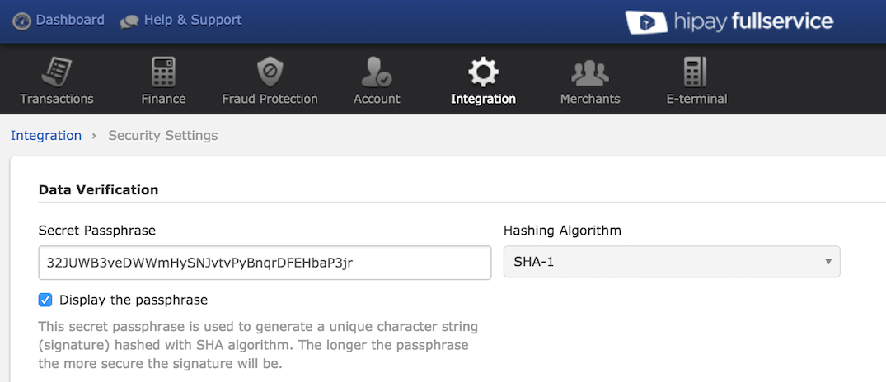

# Generating a server-side signature 

In order to perform some actions with the HiPay Fullservice SDK for Android, such as making a payment or getting transaction details, you need to generate a *signature* on the server side beforehand.

The *signature* will be used as an additional **parameter** for these `GatewayClient` methods: 

- Request a new order,
- Initialize a hosted payment page,
- Get transaction details.

The signature parameter is necessary for security purposes and must be generated on your server beforehand for each order to be paid on the HiPay Fullservice SDK for Android. You can get more details about these methods in the ["Advanced usage"](#usage-making-payments-core-wrapper-advanced-integration) section.

## Signature calculation

The signature is the **SHA-1 hash** of these four parameters concatenation:

- Order ID,
- Amount (formatted with two decimal places, example: 72.10),
- Currency,
- Secret passphrase.

The signature has to be generated beforehand on the **server side** in order not to show the **secret passphrase** in client code.  
That is why the code examples below are executed in PHP/Python and not embedded in the Android app directly. This code has to be hosted somewhere on your servers.

Please find below some code examples for signature generation.

#### PHP
```PHP
<?php

$orderId = 'TEST_89897';
$amount = 14.1;
$currency = 'EUR';
$passPhrase = '32JUWB3veDWWmHySNJvtvPyBnqrDFEHbaP3jr';

$signature = sha1($orderId . number_format($amount, 2) . $currency . $passPhrase);

echo $signature;

```

#### Python
```Python
import hashlib

orderId = 'TEST_89897'
amount = 14.1
currency = 'EUR'
passPhrase = '32JUWB3veDWWmHySNJvtvPyBnqrDFEHbaP3jr'

signature = hashlib.sha1(orderId + '{0:.2f}'.format(amount) + currency + passPhrase)

print(signature.hexdigest())
```

The codes above generate a signature which is to be used by the HiPay Fullservice SDK for Android.

To get the **secret passphrase** of your account, go to the "Integration" section of your HiPay Fullservice back office, then to "Security Settings".



You may choose a secret passphrase if you don't have one already. This passphrase is also used to process server-to-server notifications.

## Mobile app implementation

The Android SDK needs to use the signature in order to make transactions.  
Please find below an Android code example querying the merchant's server (yours) to get the signature and then initializing the SDK's payment page with the signature.

```JAVA
public void onClick(View view) {

    final String orderId = "TEST_89897";

    /* Assuming that the server url takes the orderId as argument
     * and generates the signature after retrieving 
     * the required data in the database */

    String url = String.format(getString(R.string.server_url), orderId);

    RequestQueue requestQueue = Volley.newRequestQueue(getActivity());

    // Assuming that the server's response is in JSON format
    JsonObjectRequest jsObjRequest = new JsonObjectRequest
            (Request.Method.GET, url, null, new Response.Listener<JSONObject>() {

                @Override
                public void onResponse(JSONObject response) {
                    try {

                        String signature = response.getString("signature");
                        String amount = response.getString("amount");
                        String currency = response.getString("currency");

    	                /* Once we get the signature, we can instantiate
                         * and present the payment screen */

    	                PaymentPageRequest request = new PaymentPageRequest();

    	                request.setOrderId(orderId);
    	                request.setAmount(Float.parseFloat(amount));
    	                request.setCurrency(currency);
    	
                        PaymentProductsActivity.start(MyActivity.this, 
                            request, 
                            signature, 
                            null);

                    } catch (JSONException e) {
                        e.printStackTrace();
                    }
                }

            }, new Response.ErrorListener() {

                @Override
                public void onErrorResponse(VolleyError error) {
                    // handle the error
                }
            });

    requestQueue.add(jsObjRequest);
}
```

For the sake of this example, we assume that the response is in JSON format.
Once you get the signature, you can create a `PaymentPageRequest` with the necessary parameters and then present the `PaymentProductsActivity` screen. You will get more details about the *payment screen* in the next sections.
