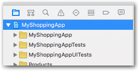
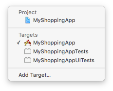
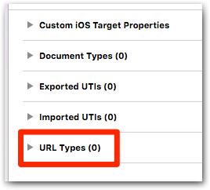

# Configuration

You need to follow all the steps below before integrating the payment workflow.

## Step 1 — Import header files

First and foremost, you need to add this line in order to use the SDK in an Objective-C app:

```objectivec
#import <HiPayFullservice/HiPayFullservice.h>
```

## Step 2 — Configure the SDK

Then, you need to provide the SDK with a few parameters, such as the credentials and targeted environment.

### Credentials

Get a valid HiPay Enterprise API username and password. If you don't have any, please refer to the [Prerequisites and recommendations](#prerequisites-and-recommendations) page.

### Determine your app URL scheme

Sometimes, your users may be redirected to web pages, for example to follow the 3-D Secure workflow or to process payments with payment methods which cannot be natively supported by the SDK. 

To do so, the SDK presents your users with a `SafariViewController` web page (on iOS 9+). Eventually, your users will be redirected back to your app using an [app URL scheme][apple-scheme].

To find your app URL schemes, open your Xcode project settings:



Make sure that your app project is selected:



Open the "Info" tab:


Expand the "URL Types" section:



You can then either re-use an existing scheme or create a new one. To do so, click on the "+" button:


Fill out the form by setting a proper identifier and a URL scheme, as follows:


Eventually, you will need to use one of the values defined in the "URL Schemes" field. In this case, it's **myshoppingapp**.

### Set up the configuration

The following code allows you to configure the SDK. We recommend putting it in your *App Delegate*'s `application:didFinishLaunchingWithOptions:` method implementation.

#### Objective-C
```objectivec
// AppDelegate.m — application:didFinishLaunchingWithOptions:

[[HPFClientConfig sharedClientConfig] setEnvironment:HPFEnvironmentStage
                                      username:@"YOUR API USERNAME"
                                      password:@"YOUR API PASSWORD"
                                      appURLscheme:@"myshoppingapp"];

[[HPFClientConfig sharedClientConfig] setPaymentCardStorageEnabled:YES withTouchID:YES];

[[HPFClientConfig sharedClientConfig] setPaymentCardScanEnabled:YES];
```

#### Swift
```Swift
// AppDelegate.swift — application:didFinishLaunchingWithOptions:

HPFClientConfig.shared()
    .setEnvironment(HPFEnvironment.stage,
    username: "YOUR API USERNAME",
    password: "YOUR API PASSWORD",
    appURLscheme: "myshoppingapp")

HPFClientConfig.shared().setPaymentCardStorageEnabled(true, withTouchID: true)

HPFClientConfig.shared().isPaymentCardScanEnabled = true
```

Do not forget to **replace the username and password arguments with your API username and password**. Also, **pass your own URL scheme** (determined in the previous section).


Note that if you enable the **payment card storage option**, since XCode 8.0 you need to **turn on the Keychain sharing in the Capabilities section of your project** to make it work.

You can find more information in the [Card storage feature](#usage-making-payments-core-wrapper-advanced-integration-card-storage-feature) page.


Once your app goes live, you need to set the environment to `HPFEnvironmentProd`.

## Step 3 — Handle callback redirection

If the SDK presents your users with a web page (for 3-D Secure or specific payment methods), they will eventually be redirected back to your app thanks to the app URL scheme.

In order for the SDK to be aware of the redirection and to receive the callback data, you need to implement the `application:handleOpenURL:` method in your *App Delegate*, as follows:

### Objective-C
```objectivec
// AppDelegate.m

- (BOOL)application:(UIApplication *)application handleOpenURL:(NSURL *)url {
    return [[HPFGatewayClient sharedClient] handleOpenURL:url];
}
```

### Swift
```Swift
// AppDelegate.swift 

func application(application: UIApplication, handleOpenURL url: NSURL) -> Bool {
    return HPFGatewayClient.sharedClient().handleOpenURL(url)
}
```

And that's it: the HiPay Enterprise SDK for iOS is properly configured.

[apple-scheme]: https://developer.apple.com/library/ios/featuredarticles/iPhoneURLScheme_Reference/Introduction/Introduction.html#//apple_ref/doc/uid/TP40007899
