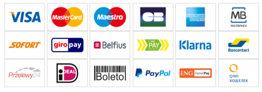
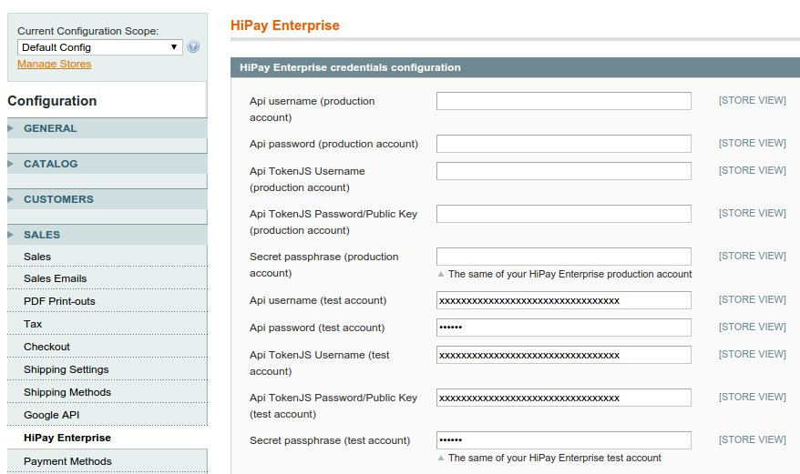
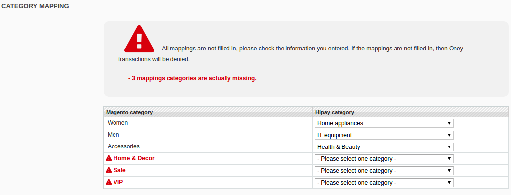
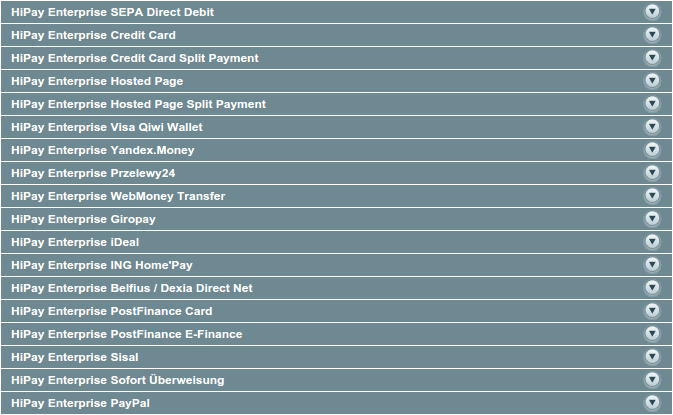
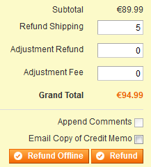
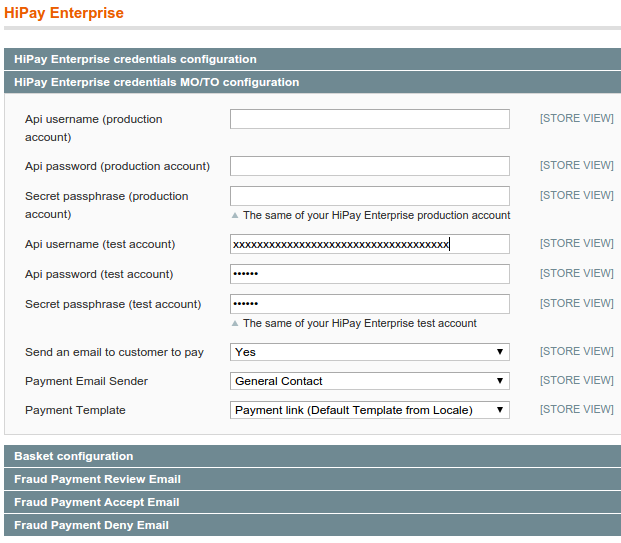
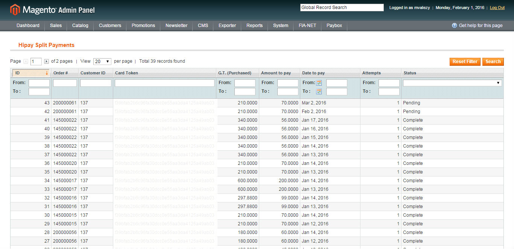
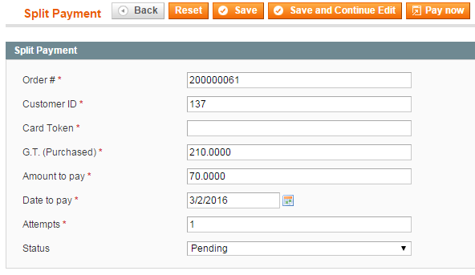
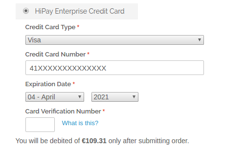

#HiPay Enterprise – Magento 1 – Integration guide

**DISCLAIMER**
While every effort has been made to ensure the accuracy of the information contained in this publication, the information is supplied without representation or warranty of any kind, is subject to change without notice and does not represent a commitment on the part of HiPay.
HiPay, therefore, assumes no responsibility and shall have no liability, consequential or otherwise, of any kind arising from this material or any part thereof, or any supplementary materials subsequently issued by HiPay.

**TECHNICAL SUPPORT** If you need any complementary information concerning the technical implementation of HiPay Enterprise, please don’t hesitate to visit our Support Center ([*http://support.hipay.com*](http://support.hipay.com)) or contact our Business IT Services.

- Email: support.tpp@hipay.com
- Telephone: +33 (0)1 82 88 68 68

#About this guide

##Purpose

This document is designed to provide you with details on how to integrate your business to the HiPay Enterprise Payment Gateway. 
This document gives you step-by-step instructions on how to simply and quickly get up and running with our services as well as detailed reference material.

Where applicable, this document refers to the related documentation with further details.

##Intended audience

This document is designed for the merchants' technical staff or system integrator.

##Copyright

The information contained in this guide is a property of HiPay. This material shall not be duplicated, published, or disclosed, in whole or in part, without the prior written permission of HiPay.

##Legal notice

This document contains the proprietary and confidential information of HiPay. Such information may not be used for any unauthorized purpose and may not be published or disclosed to third parties, in whole or part, without the express written permission of HiPay. 
You acknowledge and agree that this document and all portions thereof, including, but not limited to, any copyright, trade secret and other intellectual property rights relating thereto, are and at all times shall remain the sole property of HiPay and that title and full ownership rights in the information contained herein and all portions thereof are reserved to and at all times shall remain with HiPay. You agree to safeguard the confidentiality of the information contained herein using the same standard you employ to safeguard your own confidential information of like kind, but in no event less than a commercially reasonable standard of care. 
If you do not agree with the foregoing conditions, you are required to return this document immediately to HiPay.

#How to read this guide

##Document conventions

To ease readability and improve understanding, this document uses a number of conventions.

This guide uses several typographic conventions to highlight certain words and phrases and draw attention to specific pieces of information.
The following table clarifies the conventions used across this guide.

*Table 1: Typographic conventions that apply across this guide*

| Convention   |      Meaning      |
|----------|:-------------:|
| Mono-space |  Indicates source code, code examples, input to the command line, application output, code lines embedded in text, variables and code elements. |
| *Italics* |  Italicized regular text is used for emphasis or to indicate a term that is being defined or will be defined shortly. |
| ... |  Horizontal ellipsis points in sample code indicate the omission of part of the code (i.e. when you would normally expect additional code to appear, but such code would not be related to the example). |
| $ |  At the beginning of a command, indicates an operating system shell prompt. |
| &lt;placeholder&gt; |  Indicates placeholders, most often method or function parameters; these placeholders represent information that must be supplied by the implementation or the user. For command-line input, indicates parameter values.|

**Abbreviations used in tables**

The tables of this document describe data elements, which are equivalent to parameters in a query or to fields of a response
message. The following table helps understanding the different attributes (columns) that define a data element.

*Table 2: Description of data elements*

| Column   |      Meaning    |
|----------|:-------------:|
| Field name |  Name of the data element |
| Format |  Format of the element |
| Length |  Maximum size of the element. For example, a size of 6 means that the data value cannot exceed six characters. When no size is specified, it means that there is no limitation on the length of the field. |
| Req. |  Specifies whether an element is required or not.  **M** = Mandatory; must always be provided. **C** = Conditional; requirement depends on the value or presence of other elements. |
| Description |  Brief description of the data element and, where applicable, a list of valid values and element dependencies. |

*Table 3: Available formats of data elements*

| Format abbreviation   |      Description    |     Example    |
|----------|:-------------:|:-------------:|
| AN |  Alphanumeric characters (a-z, A-Z, 0-9)  ||
| A |  Alphabetic characters only (a-z, A-Z)  ||
| N |  Numeric characters only ||
| R |  Decimal number with explicit decimal point, signed |12.34|
| DT |  Date in the format YYYY-MM-DD |2016-12-31|
| TM |  Time in the format HH:MM with optional seconds (HH:MM:SS) |15:30|

**Acronyms and abbreviations**

The following acronyms and abbreviations are used in this guide.

*Table 4: Acronyms and abbreviations*

|Acronym or abbreviation |   Full name/meaning |
|----------|:-------------:|
|  BIN |                       Bank Identification Number
|  PAN  |                     Primary Account Number
|  PCI DSS  |                 Payment Card Industry Data Security Standard
|  REST   |                   Representational State Transfer
|  TPP   |                   Third Party Processing

#Introduction

This document describes how to install and use the HiPay Enterprise module for Magento webshop.

##Please note

-   You will need to configure your HiPay Enterprise account                                                                             
    before installing your Magento module in your HiPay Enterprise back office
    ([*https://merchant.hipay-tpp.com/*](https://merchant.hipay-tpp.com/)).
-   The HiPay Enterprise module is not offered natively on Magento,                                                                      
    you must contact HiPay to get it.
-   This module requires valid HiPay Enterprise credentials to be able to use it;
    please contact HiPay to get them.

#Release notes

Find here all the latest versions of the Magento module:

| Date |Version| Level| Main Feature | 
|----|----|----| -----------|
| 06-12-2017| 1.7.0 |Major version | Oney Facily support  
| 05-05-2017| 1.6.2 |  Minor version | Domain TokenJS
| 04-13-2017| 1.6.1 |  Minor version | Security
| 02-23-2017| 1.6.0 |  Major version | MO/TO support

#Platform configuration

##Allow your servers IP addresses

When a request is sent to the HiPay Enterprise servers, the IP address or IP address range from where the connection was made is
verified. If it matches with the IP address supplied by the merchant at a previous stage, the request will be processed. In case of missing or incorrect information, the server will respond with an appropriate error message, indicating the error in the request.

To do this, you must log in to your HiPay Enterprise back office (https://merchant.hipay-tpp.com), click on the "*Integration*" tab,
then on "*Security Settings*" and enter your IP address(es) in the "*IP Restriction*" section.

 **Important!**

When changing your IP address(es), make sure that all new IP addresses are configured for your account. If not, your server requests will be rejected.
  

##Choose a passphrase

It is strongly recommended that you use a signature mechanism to verify the contents of a request or redirection made to your servers. This will prevent customers from tampering with the data in the data exchanges between your servers and our payment system.

A unique signature is generated each time HiPay uses a merchant URL, notification or redirection.

First of all, you need to set a secret passphrase in your HiPay Enterprise back office under “*Integration -&gt; Security Settings -&gt; Secret Passphrase*”.

##Configure redirection URLs

To use the HiPay Enterprise module, you need to configure the redirection URLs in your HiPay Enterprise back office under
“*Integration -&gt; Redirect Pages*”.

-   Accept Page: `http://www.{your-domain.com}/index.php/hipay/cc/accept/`
-   Decline Page: `http://www.{your-domain.com}/index.php/hipay/cc/decline/`
-   Pending Page: `http://www.{your-domain.com}/index.php/hipay/cc/pending/`
-   Cancel Page: `http://www.{your-domain.com}/index.php/hipay/cc/cancel/`
-   Exception Page: `Empty`

Also check the "Custom" box in "*Feedback Parameters*" and apply changes.

Click on the "*Integration*" tab, then on "*Notifications*".

-   Notification URL: http://www.{your-domain.com}/index.php/hipay/notify/index
-   Request method: HTTP POST
-   I want to be notified for the following transaction statuses: ALL

Don’t forget to change {your-domain.com} by your own domain and specify the store code if you have enabled it on your Magento configuration.

#Module features

* 3-D Secure enabling/disabling
* Oneclick option configuration with custom rules
* Management of multiple cards per customer for one-click payment
* IFrame integration, hosted page and custom card API
* Mail management for transactions pending fraud validation (challenged)
* Manual and automatic capture
* Partial capture and refund
* Payment in x installments without fees
* Custom data management ( Easily send your data and view them in your HiPay Enterprise back office)
* Use order currency for transaction if your shop is multi-currency
 
The module supports the following local payment methods :
 
###Europe
 
 * **Ideal**
 * **ING Home Pay**
 * **Visa Qiwi Wallet**
 * **Paypal**
 * **SEPA Direct Debit**
 
###Swiss
 
 * **PostFinance Card**
 * **PostFinance E-Finance**
 
###Belgium
 
  * **Belfius / Dexia Direct Net**
  
###Italia
 
  * **Sisal**
 
###Germany
 
 * **Giropay**
 * **Klarna Invoice**
 * **Sofort Überweisung**
 
###Brazil and Mexico
 
 * **Itau**
 * **Bradesco**
 * **Banco do brasil**
 * **Santander HomeBanking**
 * **Aura**
 * **Caïxa**
 * **Oxxo**
 * **BBVA Bancomer**
 * **Banamex**
 * **Satader Cash**
 
###Russia
 
 * **Visa WebMoney Transfer**
 * **Yandex.Money**
 * **Przelewy24**
 
 
 
#Module installation

##Magento Connect

You can get the official HiPay Enterprise payment extension for Magento here:
[*http://www.magentocommerce.com/magento-connect/hipay-fullservice-1.html*](http://www.magentocommerce.com/magento-connect/hipay-fullservice-1.html).
To install it, just get the “extension key”. Then go to your Magento administrator back office, click on “*System* -&gt; *Magento connect
-&gt; Magento connect manager*”.

Paste the “extension key” under “Install New Extensions” and follow these
steps:

#Module configuration

##Technical configuration

Please increase the "max_inputs_vars" in the "*php.ini*" of your server.
An acceptable value is 5000.

        max_inputs_vars=5000
        
By default, this value is set to 1000 and is too low to support the saving of the HiPay module configuration.    

##General configuration

To configure your HiPay Enterprise API credentials, you must click on "*HiPay Enterprise*" in the Magento configuration section (*System -&gt; Configuration -&gt; Sales*). If you have administrative rights but are not allowed to access the configuration of the payment method, please log out and log back in.

You can find your HiPay Enterprise API credentials in your HiPay Enterprise back office, under “*Integration -&gt; Security Settings
-&gt;* *Api credentials*”.

Once you have them, put them in the module configuration with your
“*Passphrase*”. (*Please refer to section *2.2**).

When using the Multi-site or Multi-store feature: you can use different HiPay credentials and payment methods for each Store View using the “*Current Configuration Scope*” select box. Uncheck the “Use Website” checkbox and specify the desired valued.

#### Additional parameters

|  Name    | Description|
|----------|:-------------:|
|  Device fingerprint    | Define if a fingerprint is sent with the transaction ("YES" by default)
|  Use order currency for transaction *    | Define the currency used for the order. By default, orders are always processed with the base currency of the store.

If you activate "*Use order currency for transaction*", your payment method must be configured in "Sale" mode.
If you want to use this feature in "*Authorize*" mode and do "manual captures" in your back office when invocing orders,
you must develop your own "invoicing" and make an override of *Mage_Sales_Model_Order_Invoice* and method "*register*". 

If you keep the default Magento process, the transaction authorization will be processed in the currency chosen by the customer, and 
the capture upon invoicing in the *base currency* of the store.

### Customer's cart items configuration

This section addresses customer's cart items sending to the HiPay Enterprise back office during the transaction.

Enabling this option applies to all enabled payment methods on your site.
The information of the customer basket containing the method of delivery, the discounts and each product with the quantity,
the sku, the tax are sent with the transaction.

For some payment method, the sending of this information is obligatory, this option is therefore ignored if the transactions
Are carried out with this method of payment. The customer's line items will be sent whether the option is activated or not.
The payment methods concerned are **Klarna** Invoice and **Oney Facily Pay**.

Oney's Fraud system requires additional configuration for shipping method and product categories.
The configuration is explained in the following paragraph.

Please note that this feature is still in beta version. For installation and configuration purposes, please contact our Business IT Services.

|  Name    | Description|
|----------|:-------------:|
|  Send cart items   | Activate  customer's cart items sending or not ("NO" by default)
|  Attribute ean   |  EAN is not a Magento attribute by default: you must define your custom attribute if you want to send it in the basket
|  Load attribute *  |  Because EAN is not a default attribute, product loading is necessary to get the value. You can avoid loading by adding the attribute to the order and quote.  

Please assume  **"Adjustement Fee"** or **"Adjustement Refund"** are not supported with basket for refunds.  

Product loading is carried into HiPay's helper, which is **Data.php**, when information about the product is retrieved. If you want to avoid this loading, which is not fast, please add your EAN attribute in the **Quote** and **Order** model.  

There are several ways to do so. For example, you can: 

  1. Add your attribute in the "order" and "quote" tables. 
  2. Save your attribute in observer who listen *sales_quote_save_before* .
  3. Upgrade your config.xml to transfer the attribute in the "Order" with :
     
            <fieldsets>
                <sales_convert_quote>
                    <attribute_ean>
                        <to_order>*</to_order>
                    </attribute_ean>
              </sales_convert_quote>
            </fieldsets>

You can test and see the code used in the Data.php.

            // If the store supports EAN (please set the attribute in hipay config)
            if (Mage::getStoreConfig('hipay/hipay_basket/attribute_ean', Mage::app()->getStore())) {
                $attribute = Mage::getStoreConfig('hipay/hipay_basket/attribute_ean', Mage::app()->getStore());

                if (Mage::getStoreConfig('hipay/hipay_basket/load_product_ean', Mage::app()->getStore())) {
                    $resource = Mage::getSingleton('catalog/product')->getResource();
                    $ean = $resource->getAttributeRawValue($product->getProductId(), $attribute,
                        Mage::app()->getStore());
                } else {
                    // The custom attribute has to be present in quote and order
                    $ean = $product->getData($attribute);
                }
            }
            
#### Categories and shipping methods mapping

To enable sending relevant information about delivery methods and product categories, mapping 
is required between your data and HiPay data

##### Categories mapping

Only the top level categories are displayed and must be mapped. As long as you have not mapped a category a warning 
icon is displayed and prompts you to do the mapping. If the mapping is not done then the transaction will be refused 
by Oney. It is therefore important to check your mapping regularly in case of addition, modification of category.

##### Shipping methods mapping

A list of all delivery methods activated on the site is displayed.
This mapping is necessary to indicate a match between your delivery methods and the delivery methods defined at HiPay.
For each customer order, depending on the chosen configuration, this information is sent as a supplement to the customer's basket.

For each mapping, you have to fill out the following information:

   *   "Preparation delay": Estimated day time for order preparation
   *   "Delivery delay" : Estimated day time for delivery
   
From this information, an estimated delivery day is calculated and sent with the transaction.
Unworked days are not taken into account in this calculation.

As with the mapping of categories **it is important that all payment methods be mapped**, so it is important
to see your list if you change the configuration of your payment methods

##Payment methods configuration

To configure your HiPay Enterprise payment methods, click on "*Payment Methods*" in the Magento configuration section (*System -&gt;
Configuration*).

You will then see a list of payment methods with all the HiPay Enterprise integration possibilities.

### HiPay Enterprise Credit Card API
(only available for credit card and debit card payment methods)

With the HiPay Enterprise Credit Card API integration (direct API integration), customers fill in their bank information directly on
the merchants’ website. The module calls the HiPay Enterprise API to validate the transaction and the merchant’s website displays the transaction confirmation / refused / pending message.

If this integration mode is selected, you are required to be compliant with the PCI Data Security Standard. For more information, please visit “*https://www.pcisecuritystandards.org*”.

### HiPay Enterprise Credit Card Split Payment
(only available for credit card and debit card payment methods) 

This integration can be used to process recurring payments and split order payments over time through API. It is a variant of the HiPay Enterprise Credit Card API integration. Therefore, you are also required to be compliant with the PCI Data Security Standard.

Prior to activating this integration, at least one recurring profile must be created (*Please refer to section *5.6* Split payment method*).

### HiPay Enterprise Credit Card Hosted Page
(only available for credit card and debit card payment methods)

To process payments, cardholders are redirected to a secured payment page hosted by HiPay.

After payment validation, customers are redirected to the merchant's website which displays a transaction confirmation / error / pending message.

### iFrame 

You can activate the iFrame mode on your HiPay Enterprise Hosted Page if you want cardholders to fill in their payment card information on a secured payment page hosted by HiPay and displayed in an iFrame inside the merchants’ payment page.

Your website must run with the **HTTPS** protocol to use an iFrame Hosted page.

This page (hosted & iFrame) can be customized with the merchants’ CSS stylesheet to fit their website look and feel.

### HiPay Enterprise Hosted Page Split Payment
(only available for credit card and debit card payment methods)

This integration can be used to process recurring payments and split order payments over time using a hosted page.

Prior to activating this integration, at least one recurring profile must be created (*Please refer to section* **5.6** *Split payment
method*).

### Other HiPay Enterprise payment methods

If you want to offer on your website other payment methods than credit card or debit card, you can choose them directly from the list of payment methods, indicated as follows: “*HiPay Enterprise {payment method}*” (e.g.: *HiPay Enterprise Sofort Überweisung, HiPay Enterprise Sisal, etc.*).

### Configuration parameters

  
|  Name    | Description|
|----------|:-------------:|
|  Enabled    | Allows the activation of the module
|  Title| Title displayed on the front-end for the payment method
|Payment Profile | Profiles allowed if split payment is used. *Please refer to section* **5.6** *Split payment method*.
|Order status when payment accepted|                Status to be assigned to the order
|Order status when payment refused|                 Status to be assigned to the order
|Order status when payment cancelled by customer|   Status to be assigned to the order
|HiPay status to validate order| HiPay status for a Magento transaction to be validated
|Redirect page pending status| If the transaction result is pending, the customer can be redirected to a pending, success or failure page.
|Payment Action| Set the payment mode: *Authorization + Capture* (*Sale*) or*: Authorization Only*. *Please refer to https://developer.hipay.com/doc-api/enterprise/gateway/#!/payments/requestNewOrder (Response Content Type – Parameters – operation)*. Must be set to “*Sale*” for Split payment method.
|Credit Card Types|                                 Card types allowed in the payment form
|Display card owner|                                Enable/disable the cardholder input field in the payment form
|Credit Card Verification|                          Enable or disable Magento credit card verification
|Css Url| URL to merchant style sheet for iFrame or Hosted page operating modes. Important, **HTTPS** protocol is required. *Please refer to https://developer.hipay.com/doc-api/enterprise/gateway/#!/payments/generateHostedPaymentPage (Response Content Type – Parameters – css)”.*
|Page payment template|For iFrame and Hosted page operating modes, you can choose your basic template to show: **Basic:** Basic responsive design. **Basic-js:** Advanced responsive design.
|Display hosted page in iFrame|                     Activate iFrame mode on hosted page. *Please refer to chapter 4.2.*
|iFrame Height|                                     If iFrame operating mode is chosen, you can select your iFrame height to fit with your CSS.
|iFrame Width|                                      If iFrame operating mode is chosen, you can select your iFrame width to fit with your CSS.
|Wrapper iFrame Style|                              If iFrame operating mode is chosen, you can customize the wrapper around the iFrame with your CSS.
|iFrame Style|                                      If iFrame operating mode is chosen, you can select your iFrame integration style to fit with your CSS.
|Display card selector|                             Enable/disable the payment method selector on iFrame and Hosted pages.
|Enable 3D Secure|                                  Allows the activation of 3-D Secure if available on the card being used.
|Rules 3D Secure|                                   If you enabled “*3D Secure with specific rules”*, set up rules to trigger 3-D Secure only when you really need it with order, customer or product attributes.
|Use Oneclick|                                      Allows the use of Oneclick payment (only for credit cards)
|Rules Oneclick|                                    If Oneclick is used, configure the rules to activate Oneclick
|Add product to cart|                               Reload the cart when payment is cancelled or refused
|Cancel pending order|                              Cancel pending orders over 30 minutes (by default)
|Delay before cancel order|                         Adjustment of cancelling period
|Send fraud payment email|                          Alert the client if a transaction has been challenged and requires approval
|Payment from applicable countries|                 Restricted access by country
|Payment from specific countries|                   List of allowed countries
|Minimum Order Total|                               Minimum amount to display the payment method
|Maximum Order Total|                               Maximum amount to display the payment method
|Sort Order|                                        Sort the payment method order in the front-end
|Enable debug log|                                  Log requests and server responses on the "var/log/payment\_hipay\_cc.log" file
|Enable test mode|                                  If Test mode is enabled, the module will use the HiPay Enterprise test platform.
  
#Payment configuration

##“Sale” mode

When making a purchase with the “sale” mode, the capture is automatically requested right after the authorization. *Please refer to https://developer.hipay.com/doc-api/enterprise/gateway/#!/payments/requestNewOrder (Response Content Type – Parameters – operation)*.

If the payment fails, the customer is redirected to the error page and the status is defined like configured in the module configuration.

If successful, the customer is redirected to the success page, the invoice is created if the configuration allows it and the status is
defined as follows:

-   “capture_waiting”
-   “processing”

##“Authorization” mode 

When making a purchase with the "Authorization" mode, the transaction will be on “waiting capture”. *Please refer to https://developer.hipay.com/doc-api/enterprise/gateway/#!/payments/requestNewOrder (Response Content Type – Parameters – operation)*.

The customer is not charged directly: you have 7 days to "capture" the transaction and charge the customer. Otherwise, the order will be cancelled.

If the payment fails, the customer is redirected to the error page and the status is defined like configured in the module configuration.

If successful, the customer is redirected to the success page. At this step, the order status is “*Waiting for capture*”. Once you’re ready to capture the transaction:

-   If the configuration does not allow the creation of invoice, you must create the invoice from the order overview. Click on
    “*Capture online*”: this will send the capture information to the HiPay Enterprise server. If successful, the invoice is created.   
    The payment is then captured and you can create your shipment.
-   If the configuration allows the creation of invoice, click on the invoice and on the “*capture”* button. This will send the capture
    information to the HiPay Enterprise server. If successful, the invoice status changes to “*Paid*”.

You can also do the “*capture*” directly in your HiPay Enterprise back office. The invoice will then be automatically created in your Magento back office.

##Refund

HiPay Enterprise allows online refunds. For this purpose, simply create a "*credit memo*" on the invoice (not from the order).

You have two options: “*Refund Offline*" (not relevant in our case) or "*Refund*".

Choose the amount and click on “*Refund*”. If successful, the credit memo is created and the refund is validated.

##One-click (only available for credit card payment methods) 

If the one-click option is activated, it enables your system to create an “*alias*” of the credit card. That way, after their first transaction, customers can use a saved credit card without having to fill in all the payment data again.

This option is only available if customers have created an account on your site.

##MO/TO payment (please contact HiPay to create a MO/TO account)

Here are the instructions to follow when merchants need to create a new order and pay it using the customer's financial information given over the phone.

### Configuration

- Under “*System -&gt; Configuration -&gt; HiPay Entreprise*”, fill in specific credentials for MO/TO transactions in the 
    "HiPay Enterprise credentials MO/TO" section. If they are not specified, standard credentials will be used.
 
- You can also configure the following settings.

|  Name    | Description|
|----------|:-------------:|
|  Send an email to customer for paying    |  If "YES", an email with a payment link is sent to the customer for hosted payment. If "NO", the payment has to be done by the admin in the backend.    
|  Payment Email Sender   | Choose the sender of the email with the payment link.      
|  Payment Template   | Choose the email template.       

### MO/TO payment for hosted methods

- Create a new order in your Magento back office.
    1.  Go to “*Sales -&gt; Create New Order*”.
    2.  Add your products, account information, billing address,
        shipping address, payment method, shipping method, etc.
    3.  Submit your order.  
    4.  An email is sent to the customer with a link for paying the order.
    5.  The customer clicks on the link in the email and is redirected to the hosted payment form.
    6.  The customer pays and is redirected to your Magento front-end (success or error page). 
    7.  The status of the order is changed to "processing".
    
##Split payment method

### Payment profile

Prior to activating a split payment method, you must create one or more
payment profiles under: *Sales &gt; HiPay &gt; Split Payment Profiles &gt; Add payment profile*.

A payment profile defines the billing cycle of an order, for example:

### Configuration parameters

|Name|                     Description
|----------|:-------------:|
|Name|                     Name of the payment method displayed on the front-end
|Billing Period Unit|      Unit of time for billing during the subscription period
|Billing Delay|             Number of billing periods that make up one billing cycle
|Maximum Billing Cycles |   Number of billing cycles for the payment period

Please note: when configuring your payment method, you must select “*Sale”* as your “*Payment Action”*.

### Split payments scheduling (Cron)

A daily cron may be setup to launch the “*hipay_pay_split_payment”* method.

### Split payment management

An installment plan will be created for each new split payment when the first payment is successful. You can follow the status and the due date of each payment under:\*Sales* *&gt;* *HiPay* *&gt; Split payments*.

Split payment statuses:

-   “*Complete*” payments have been processed and no further action is needed.
-   “*Pending*” payments are not processed yet: you can change the date or other parameters.
-   “*Failed*” payments: you will receive an email when a split payment has failed and an action is required. You can retry the payment by switching the status to "Pending".

### Split payment retry

You can change the due date or force payment immediately for pending or failed split payments:

#Front-end payment examples

##Payment method selection

##HiPay Enterprise Credit Card API 

##HiPay Enterprise Credit Card Hosted Page with One-Click 

##HiPay Enterprise Hosted Page Split Payment 

##HiPay Enterprise XXXX (other payment methods) 
 

##HiPay Enterprise Hosted Page with iFrame 

## Custom data

The Magento HiPay module allows you to send custom data with transactions and see this information in your HiPay Enterprise back office.

If you want to develop your own custom data, please take the *CustomData.php* file in the "extra" folder and put it in the HiPay module sources in the "/AlloPass/Hipay/Helper" folder.
You have to implement the "getCustomData" method and return an array with your data.

## Frequent problems 

If you have problems with authorization and capture notifications, please check if an observer is listening to the events **sales_order_save_after** or **sales_order_invoice_save_after**, and that there is no exception in them.

If an exception is raised during the chain of observers, the HiPay notification will be in error and the order status will not change.
